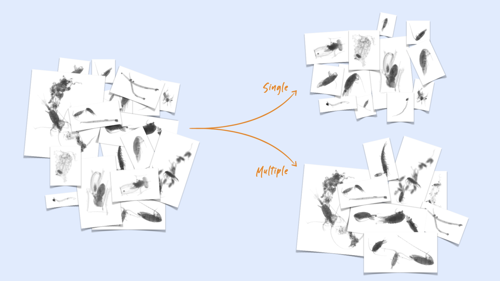

# zooprocess-multiple-classifier
[](https://jenkins.services.ai4os.eu/job/AI4OS-hub/job/zooprocess-multiple-classifier/job/main/)

An AI module to differentiate images containing multiple zooplankton objects from those containing only one object.

This module processes regions of interest (ROIs or _vignettes_) extracted by [ZooProcess](https://sites.google.com/view/piqv/softwares/flowcamzooscan) from an original image taken by the ZooScan instrument.

These ROIs should contains only one object for later classification. This module predicts whether an ROI contains multiple objects, so that it can then be further separated before their classification. The separation is done by another module called [`ai4os-zooprocess_multiple_separator`](https://github.com/ai4os-hub/zooprocess-multiple-separator).

This application uses a MobileNet v3 classifier trained towards maximizing the recall of the `multiple` class. It returns the probability that the image contains multiple objects (and a natural threshold to predict it in the multiple class is therefore 0.5; but it could be lowered to further increase the recall of multiple objects).

This module was developed as part of the [iMagine](https://www.imagine-ai.eu) project and in partnership with the [FOTONOWER](http://fotonower.com/) company.

## Run the module's API

To launch it, first install the package then run [deepaas](https://github.com/ai4os/DEEPaaS):

```bash
git clone https://github.com/ai4os-hub/zooprocess-multiple-classifier
cd zooprocess-multiple-classifier
pip install -e .
deepaas-run --listen-ip 0.0.0.0 --model-name zooprocess_multiple_classifier
```

Then browse to <http://localhost:5000> and you should get a simple message as a response, verifying that everything works as intended.
Finally, browse to <http://localhost:5000/api> to get access to the graphical interface and documentation of the deepaas API for this model.

## Docker images

Once a version is pushed to the main branch, it should be built automatically through [AI4OS Jenkins service](https://jenkins.services.ai4os.eu/job/AI4OS-hub/job/zooprocess-multiple-classifier/) and become available from [dockerhub](https://hub.docker.com/r/ai4oshub/zooprocess-multiple-classifier/tags).

Getting the image works through
```bash
docker pull ai4oshub/zooprocess-multiple-classifier:latest
```

When running the docker image, map port 5000 from inside the docker to a port on the machine running docker (e.g. 55000). Then replace `http://localhost:5000` above by the ip/name of the machine and the port you mapped 5000 to (55000 in the example above).



## Project structure

```
│
├── Dockerfile             <- Describes main steps on integration of DEEPaaS API and
│                             zooprocess_multiple_classifier application in one Docker image
│
├── Jenkinsfile            <- Describes basic Jenkins CI/CD pipeline (see .sqa/)
│
├── LICENSE                <- License file
│
├── README.md              <- The top-level README for developers using this project.
│
├── VERSION                <- zooprocess_multiple_classifier version file
│
├── .sqa/                  <- CI/CD configuration files
│
├── zooprocess_multiple_classifier    <- Source code for use in this project.
│   │
│   ├── __init__.py        <- Makes zooprocess_multiple_classifier a Python module
│   │
│   ├── api.py             <- Main script for the integration with DEEPaaS API
│   |
│   ├── config.py          <- Configuration file to define Constants used across zooprocess_multiple_classifier
│   │
│   └── misc.py            <- Misc functions that were helpful accross projects
│   │
│   └── utils.py           <- Contains the actual code to perform inference
│
├── data/                  <- Folder to store the data
│
├── models/                <- Folder to store models
│   
├── tests/                 <- Scripts to perfrom code testing
|
├── metadata.json          <- Metadata information propagated to the AI4OS Hub
│
├── pyproject.toml         <- a configuration file used by packaging tools, so zooprocess_multiple_classifier
│                             can be imported or installed with  `pip install -e .`                             
│
├── requirements.txt       <- The requirements file for reproducing the analysis environment, i.e.
│                             contains a list of packages needed to make zooprocess_multiple_classifier work
│
├── requirements-test.txt  <- The requirements file for running code tests (see tests/ directory)
│
└── tox.ini                <- Configuration file for the tox tool used for testing (see .sqa/)
```
